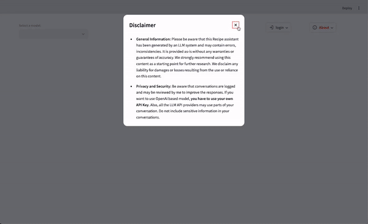
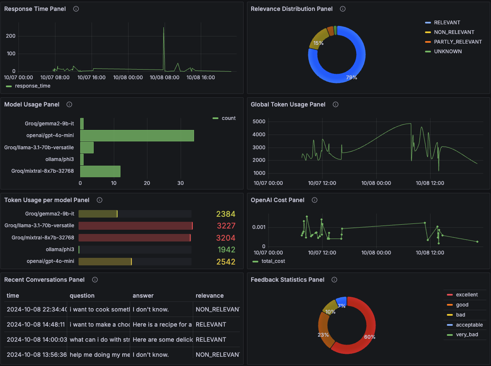

# Digital Recipe Assistant
[](https://www.python.org/downloads/)
[](https://console.groq.com/)

[](https://console.groq.com/)
[](https://numpy.org/)
[](https://pandas.pydata.org/)
[](https://pypi.org/project/psycopg2/)
[](https://scikit-learn.org/)
[](https://platform.openai.com/docs/overview)
[](https://black.readthedocs.io/en/stable/)
[](https://isort.readthedocs.io/en/latest/)
[](https://pre-commit.com/)
[](https://pylint.pycqa.org/en/latest/)

<br>

This is repository contain the code to build a digital recipe assistant.


Most of us don't often know what to eat even with many ingredients in our kitchen. This digital assistant provides a tool to find a recipe for you in a conversational way.

## Project overview

Yhis recipe assistant can help you to find the best recipe according to the ingredients. You can directly ask any questions about the cooking process and it will return you the complete recipe. Sometimes based on your entry, you can have several suggestions and an image of the final meal if available.

## Dataset
The dataset used here contains:

- **List of ingredients** a list of ingredients used to cook a specific meal
- **Title** the recipe name
- **Instructions** the isntruction to cook the meal
- **Image name** the name of the image file.

Recipe data that can be downloaded on [kaggle](https://www.kaggle.com/datasets/pes12017000148/food-ingredients-and-recipe-dataset-with-images?resource=download). The dataset contains
than 13 501 recipes from [epicurious.com](https://www.epicurious.com/).


## Technologies
| Name | Scope |
| --- | --- |
| Jupyter Notebook | Exploratory data analysis|
| Docker | Application containerization|
| Docker-Compose | Multi-container Docker applications definition and running|
| OpenAi, Groq, Ollama| LLM|
| Streamlit| User interface |
| PostgreSQL| storage|
| Grafana | Dashboard and monitoring |
| pytest | Python unit testing suite |
| pylint | Python static code analysis |
| black | Python code formatting |
| isort | Python import sorting |
| Pre-Commit Hooks | Code issue identification before submission |

We use a customized version of - [Minsearch](https://github.com/alexeygrigorev/minsearch) for full-text search. Our implementation can be find in [Minsearch](notebooks/minsearch.py) and [Minsearch](recipe_assistant/minsearch.py). In our implementation we add semantic search and hybrid search. The user can choose in `.env` file the model to compute embeddings, choose to rerank the search with a specific model.

In our implementation, we don't use elasticsearch cause it doesn't give good performance in the evaluation step. Also, we don't use reranking cause the performance decrease with that. But the user can choose its own reranking model and try.

The user has choice between the following models:


- `Groq/gemma2-9b-it`
- `Groq/llama-3.1-70b-versatile`
- `Groq/mixtral-8x7b-32768`
- `ollama/phi3`
- `openai/gpt-3.5-turbo`
- `openai/gpt-4o`
- `openai/gpt-4o-mini`
## Project setup

1. You need a key from OpenAi or Groq depending on the model you choose. If your key is not valid, the chat will not start. You have to place the key in the `.env` file. This file, i defined it as `dev.env` you have to change the name and write your own credentials. Also change the variable `TZ_ZONE` in  `.env` file to change your time zone (mostly for grafana).

2. You can start the project by running `make init-docker` in the terminal or by typing `docker-compose up`.

3. Once docker finish to launch everything, prepare the database and index the documents by running `make init-index-db`.


2. If you want to use phi3 you have to pull the model first by running `make pull-phi3`.

The pipenv environment is just use for development to make some code quality checks and github pre-commit.

## Running the application

You just need to go to [http://localhost:8501/](http://localhost:8501/) since docker compose have make everything up.

1. You need to choose a pseudo first. Each user can have several sessions (each run of streamlit), each session can have several chats and each chat several conversation.
2. Select a model to start a chat. Make sure that your LLM API key is valid if not the chat will not be displayed.
3. After a certain number of conversation, you can click on the button `new chat` to initialise a new chat.
4. If you have check show history, the latest 5 chats will be listed in the sidebar and you can click on any one and continue your conversation.




## Experiments

For experiments, we use Jupyter notebooks.
They are in the [`notebooks`](notebooks/) folder.

We have the following notebooks:

- [`clean_data.ipynb`](notebooks/clean_data.ipynb): To clean the data and save it to [`clean_data.csv`](data/clean_data.csv)
- [`rag-test.ipynb`](notebooks/rag-test.ipynb): The RAG flow and evaluating the system.
- [`evaluation-data-generation.ipynb`](notebooks/evaluation-data-generation.ipynb): Generating the ground truth dataset for retrieval evaluation. The ground truth is composed of 67 505 questions.

## Code

The for the application can be found in [recipe_assistant](recipe_assistant/) folder:

- [`app.py`](recipe_assistant/app.py) - the entrypoint to the application containing the logic of the user interface
- [`assistant.py`](recipe_assistant/rag.py) - the main RAG logic for building the retrieving the data
- [`app_utils/ui.py`](recipe_assistant/app_utils/ui.py) - the definition of some ui widgets
- [`app_utils/utils.py`](recipe_assistant/app_utils/utils.py) - some utility function
- [`app_utils/cst.py`](recipe_assistant/app_utils/utils.py) - define some constant values
- [`prompt_builder.py`](recipe_assistant/prompt_builder.py) -  building the prompt and defining the welcome message
- [`minsearch.py`](recipe_assistant/minsearch.py) - an in-memory search engine
- [`db.py`](recipe_assistant/db.py) - the logic for interacting with postgres
- [`prep.py`](recipe_assistant/prep.py) - the script for initializing the database, index the documents.


### Interface
We use streamlit to build a nice user interface. Refer to the ["Running the application" section](#running-the-application)

### Ingestion
With the script [`prep.py`](recipe_assistant/prep.py), we index the documents and save it to [app_utils/](recipe_assistant/app_utils/) as pickle file. We have to run this file just after launching docker compose. Once the file is saved, we don't need the data anymore. This file is loaded after by [`assistant.py`](recipe_assistant/rag.py).


### Retrieval evaluation

* minsearch text
    + hit_rate: 62.07%
    + mrr: 49.16%

* minsearch vector
    + hit_rate: 62.41%
    + mrr: 49.15%

* minsearch hybrid
    + hit_rate: 67.22%
    + mrr: 53.20%


* elastic search text
    + hit_rate: 53.64%
    + mrr: 43.08%

* elastic search vector
    + hit_rate: 56.78%
    + mrr: 47.74%

The best boosting parameters with minsearch hybrid:

```python
boost = {'Title': 1.301766512843531,
         'Instructions': 0.7387164179150028,
         'text': 0.36555723393033346
        }
```
the `text` field is the weight for `text search` and `1-text` is the weight for `vector search`.

* minsearch hybrid improved with boosting
    + hit_rate: 68.48%
    + mrr: 56.94%

* reranking with `cross-encoder/ms-marco-MiniLM-L-6-v2` as model with boosted hybrid minsearch.

    + hit_rate: 57.69%
    + mrr: 54.37%

The retrieval score is low because some questions generated is difficult to agnostically link them to a recipe.

Exemple: `How long does the chicken need to rest after roasting before serving?`

### RAG Evaluation

We sample 2000 data to evaluate our RAG flow.

We just run it for `gpt-4o-mini` due to the time and cost

- RELEVANT        1872 (93.6%)
- PARTLY_RELEVANT  116 (5.8%)
- NON_RELEVANT      12 (0.6%)


## Monitoring

We use Grafana for monitoring the application.

It's accessible at [localhost:3000](http://localhost:3000):

- Login: "admin"
- Password: "admin"

### Dashboards

<p align="center">
  
</p>

The monitoring dashboard contains several panels:

1. **Response Time (Time Series):** A time series chart showing the response time of conversations over time.

2. **Relevancy (Donut):** A Donut chart representing the relevance of the responses provided during conversations.

3. **Model Used (Bar Chart):** A bar chart displaying the count of conversations based on the different models used within the selected time range.

4. **Global Tokens (Time Series):** Time series chart that tracks the number of tokens used in conversations over time.

5. **Tokens used per model (Bar Chart):** A bar chart displaying the number of tokens used per model within the selected time range.

6. **OpenAI Cost (Time Series):** A time series chart showing the cost associated with OpenAI usage over time.

7. **Last 5 Conversations (Table):** Displays a table showing the five most recent conversations, including details such as the question, answer, relevance, and timestamp.

8. **Very Bad to Excellent (Donut Chart):** A pie chart that visualizes the feedback from users, showing the degree of user satisfaction.


### Setting up Grafana

All Grafana configurations are in the [`grafana`](grafana/) folder:

- [`init.py`](grafana/init.py) - for initializing the datasource and the dashboard.
- [`dashboard.json`](grafana/dashboard.json) - that contain our dashboard.

To avoid issue due, you have to export the following environment variables:

```bash
export POSTGRES_HOST="localhost"
export GRAFANA_ADMIN_USER=admin
export GRAFANA_ADMIN_PASSWORD=admin
export POSTGRES_DB= your_postgres_DB_as_define_in_.env
export POSTGRES_USER= your_postgres_user_as_define_in_.env
export POSTGRES_PASSWORD= your_postgres_password_as_define_in_.env
export POSTGRES_PORT=5432
```

then run (make sure you have install python and the package `requests`)

```bash
python grafana/init.py
```

Then go to [localhost:3000](http://localhost:3000):

- Login: "admin"
- Password: "admin"

When prompted, keep "admin" as the new password.
